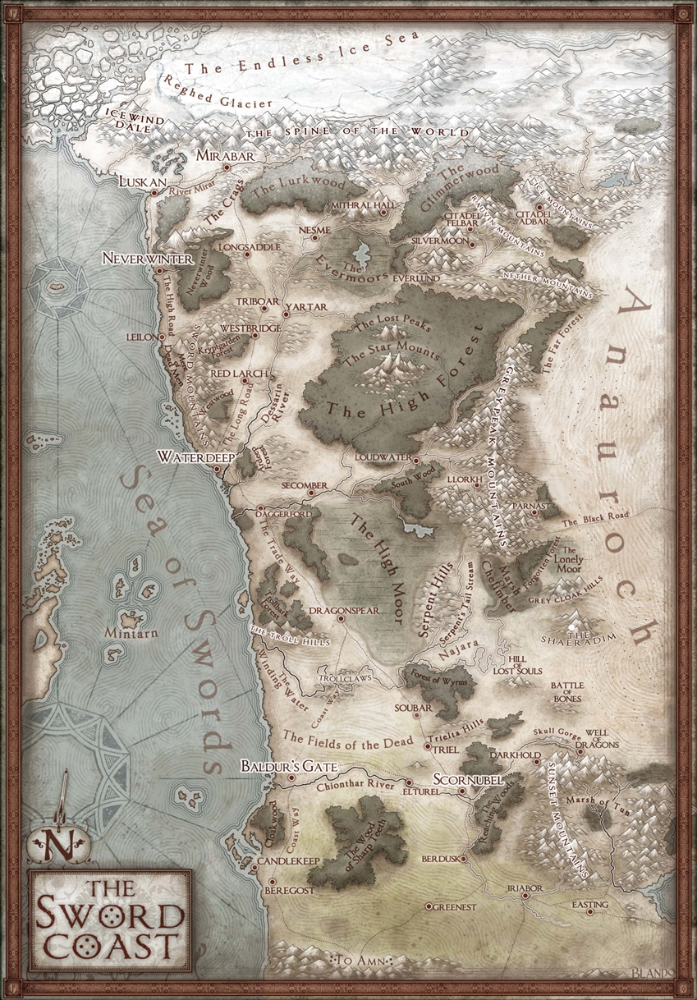

# Prólogo

Nas vastidões sombrias da Fronteira Selvagem, conhecida como o Norte, um cenário de beleza cruel se desdobra. Terra fria, áspera e pouco povoada, onde montanhas cobertas de neve se erguem solitárias, colinas rochosas se estendem e florestas esparsas escondem segredos ancestrais.

Banhada pelo Mar das Espadas a oeste e cercada pelo Deserto de Anauroch a leste, a Fronteira Selvagem se estende do Vale do Vento Gélido ao norte até a cidade de Vau da Adaga ao sul. Estradas antigas serpenteiam, ligando fortalezas anãs a assentamentos costeiros e cidades fronteiriças.

No entanto, além da beleza selvagem, a região é assombrada por ameaças sombrias. Dragões malignos, servos de Tiamat, uma vez aterrorizaram os assentamentos. Agora, gigantes emergem de suas fortalezas com ferocidade, ameaçando todos os habitantes. Rumores de ataques ecoam nas cidades costeiras, alimentando o medo de uma guerra iminente.

Enquanto a Fronteira Selvagem treme sob a sombra crescente dos gigantes, destinos são forjados e heróis são chamados para desafiar as trevas que se erguem sobre a terra. Onde a aventura começa, somente os bravos ousarão adentrar.

# Informações gerais

- O mundo está situado na Costa das Espadas, uma região de grande importância comercial e política, conhecida por suas cidades prósperas e portos movimentados.
- Cidades notáveis incluem 
    - Águas Profundas (Waterdeep), uma metrópole cosmopolita e centro de comércio; 
    - Neve Nunca (Neverwinter), conhecida por suas águas termais e influência cultural; 
    - e Luskan, uma cidade portuária conhecida por suas atividades mercantis e sombrias.
- A região é marcada por sua diversidade, com uma mistura de raças e culturas convivendo em meio aos desafios da vida na Costa das Espadas.
- O comércio marítimo desempenha um papel crucial na economia, com rotas comerciais movimentadas ligando as cidades costeiras a outras regiões do mundo.
- Além das oportunidades oferecidas pelo comércio, a região também enfrenta ameaças constantes, como invasões de criaturas monstruosas, piratas e conflitos políticos entre as cidades-estado.