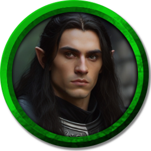
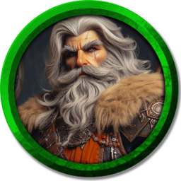
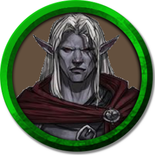
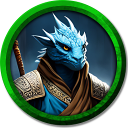
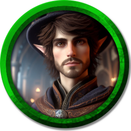
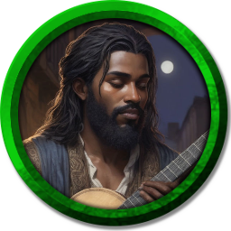
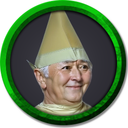

# Personagens da campanha

Aqui há os detalhes de cada personagem presente na campanha.

- [Aken Iliron](#aken)
- [Decinho CDs](#decinho)
- [Guttson Lo-Kag](#guttson)
- [Komodo](#komodo)
- [Kraft](#kraft)
- [Lyssander Novoice](#lysander)
- [Ramém](#ramem)

 

## Aken Iliron

**Raça e Classe:**
- **Raça:** Meio-elfo
- **Classe:** Paladino
- **Alinhamento:** Neutro Bom

**História:**
- **Origens:** Aken cresceu nas terras de Valfenda, órfão de guerra, sob o olhar atento dos guerreiros de seu esquadrão. Encontrou conforto e camaradagem entre seus companheiros de batalha, liderando-os com coragem contra as forças das trevas que ameaçavam a paz.
- **Motivações:** Encontrar seu propósito na proteção daqueles que ama e garantir a segurança de seu povo.
- **Eventos Marcantes:**
  - Durante uma emboscada sombria nas fronteiras de Valfenda, Aken enfrentou um inimigo formidável, percebendo a importância do amor e da lealdade de seu esquadrão.
  - Sobrevivendo à batalha, Aken tornou-se um líder reconhecido pelos soldados, simbolizando esperança e compreensão da dor da guerra.

**Personalidade:**
- **Corajoso e Leal:** Aken é corajoso no campo de batalha e leal aos seus companheiros, protegendo-os com determinação e vigor.
- **Empático e Compreensivo:** Ele compreende a dor da guerra e valoriza a união entre os soldados, sendo um líder que se preocupa com o bem-estar de seus irmãos de armas.
- **Determinado e Protetor:** Mesmo enfrentando cicatrizes físicas e emocionais, Aken encontrou seu propósito na proteção daqueles que ama, dedicando-se a garantir a segurança de seu povo.

**Aparência:**
- **Descrição Física:** Homem de longos cabelos pretos e lisos, orelhas pontiagudas e pele branca de homem. Não possui barba.
- **Marca Distintiva:** Usa uma armadura grande e escura, combinando com suas vestimentas pretas, refletindo sua determinação e força.

 

## Decinho CDs

**Raça e Classe:**
- **Raça:** Anão da Montanha
- **Classe:** Bárbaro Berserker
- **Alinhamento:** Neutro (com tendências caóticas devido à sua busca incessante)

**Aparência:**
- **Descrição Física:** Decinho tem uma longa barba branca e cabelos igualmente longos e lisos. Sua aparência robusta é acentuada por sua constituição forte e a presença de uma cicatriz que vai da têmpora até a parte interior da sobrancelha.
- **Vestimenta:** Ele veste uma armadura robusta, sugerindo sua experiência em combate, e segura um grande machado, símbolo de sua força e fúria berserker.
- **Marcas Distintivas:** A cicatriz na testa, a barba marcante e o visual de guerreiro com tons escuros e terrosos.

**Traços de Personalidade:**
- **Teimoso:** Decinho raramente muda de ideia uma vez que toma uma decisão, especialmente quando se trata de cerveja.
- **Melancólico:** A tragédia de sua taverna deixou uma marca profunda, e ele muitas vezes se perde em memórias do passado.
- **Corajoso:** Apesar de suas falhas, Decinho não tem medo de enfrentar perigos em sua busca.

**História do Personagem:**
- **História Pessoal:** Decinho nasceu na cidade montanhosa de Bergheim, sendo o orgulho de sua família, que possuía a famosa taverna "O Malte Dourado". Ele passou anos aperfeiçoando suas receitas e tornou-se conhecido por suas criações mágicas de cervejas. Um trágico acidente, enquanto preparava a bebida da fúria incansável, resultou em uma disputa entre magos que destruiu sua taverna e manchou sua alma e reputação.
- **Motivações:** Decinho busca a lendária Cerveja Eterna, que promete um sabor divino e longevidade sobrenatural. Esta busca é tanto uma tentativa de redescobrir sua paixão pela cervejaria quanto um meio de restaurar sua honra perdida.
- **Medos:** Decinho teme nunca ser capaz de superar a qualidade de suas criações perdidas e que sua busca pela Cerveja Eterna seja em vão.
- **Conexões:**
  - **Família e Amigos:** A família proprietária do "Malte Dourado".
  - **Inimigos:** Magos envolvidos na tragédia de sua taverna.
  - **Aliados:** Potenciais aliados que encontra em sua jornada, especialmente aqueles que compartilham do interesse em cervejas mágicas.

 

## Guttson Lo-Kag

**Raça e Classe:**
- **Raça:** Elf-Goliath
- **Classe:** Monge (Capoeirista)
- **Alinhamento:** Caótico Neutro

**História:**
- **Origens:** Guttson, filho do lendário Gattson, cresceu ouvindo histórias emocionantes sobre as façanhas de seu pai. Fascinado desde tenra idade pelas aventuras perigosas e pelo mundo de riquezas e segredos que seu pai explorava como um habilidoso ladino.
- **Motivações:** O desaparecimento de seu pai durante sua última expedição deixou Guttson com uma profunda necessidade de descobrir a verdade por trás do ocorrido e honrar o legado de seu pai.
- **Eventos Marcantes:** O legado paterno de Gattson, incluindo a adaga especial e a carta com um segredo, desencadeou a jornada de Guttson em busca de respostas e redenção.

**Personalidade:**
- **Determinado e Corajoso:** Armado com a determinação e coragem de seu pai, Guttson segue as pistas deixadas para trás por Gattson, enfrentando perigos inimagináveis, desafios mortais e traições surpreendentes.
- **Respeito e Admiração:** Guttson admira profundamente seu pai e busca seguir seus passos, tanto em suas habilidades como aventureiro quanto em sua integridade moral.
- **Curioso e Investigativo:** Intrigado pelo segredo deixado por seu pai, Guttson é movido pela curiosidade e desejo de desvendar mistérios.

**Conexões:**
- **Gattson, o Pai:** Guttson é profundamente ligado ao seu pai, cujo desaparecimento desencadeou sua jornada em busca da verdade.

**Aparência:**
- **Descrição Física:** Guttson possui cabelos longos, lisos e brancos, pele roxa clara e orelhas grandes e pontiagudas, características de sua herança elfo-goliath.
- **Vestimenta:** Usa uma armadura cinza parcial para permitir mobilidade, com uma vestimenta roxa por baixo. Completa o visual com uma capa vermelha, que contrasta com suas cores e destaca sua presença.

 

## Komodo

**Raça e Classe:**
- **Raça:** Draconato (Dragão Azul)
- **Classe:** Monge
- **Alinhamento:** Neutro (com tendências de redenção e compaixão)

**História:**
- **Origens:** Komodo é um exilado do Clã Bahara, acusado de um crime que não cometeu: o roubo dos pergaminhos ancestrais e destruição da biblioteca onde eram guardados. Expulso com apenas a roupa do corpo e algumas moedas, vagou por meses, passou fome e frio até chegar ao Monastério Krynn, na cidade de Zandala, onde os monges o deram comida quente e um lugar para morar. Lá, encontrou paz e ordem.
- **Motivações:** Ainda mantém respeito pelo seu clã e busca provar sua inocência e se redimir. Saiu do monastério em busca de aprender mais sobre o mundo e se redimir com seu clã.
- **Eventos Marcantes:** O isolamento e o posterior retorno à sociedade revelaram uma fraqueza por alguns prazeres mundanos, enquanto sua experiência no monastério o deixou com dificuldade em interações sociais.

**Traços de Personalidade:**
- **Dificuldade Social:** Por conta da vida no monastério, tem dificuldade em interações sociais e habilidades sociais, o que pode gerar desconforto nos outros.
- **Mente Distraída:** Adquiriu a mania de se perder em seus próprios pensamentos, se tornando alheio ao mundo ao seu redor.
- **Compêndio de Fraquezas e Virtudes:** Revelou uma fraqueza por alguns prazeres mundanos após seu exílio, mas mantém orgulho de suas origens draconicas e da tradição monástica que aprendeu com seus mestres monges. Sua experiência de vida o deixou com grande compaixão por quem passa necessidades.

**Conexões:**
- **Monastério Krynn:** Os monges do Monastério Krynn, onde Komodo encontrou refúgio e aprendeu os princípios da paz e ordem.

**Aparência:**
- **Descrição Física:** Possui pele azul escamosa e pele de dragão, assemelhando-se a um dragão humanoid.
- **Vestimenta:** Sua vestimenta completa em tons de marrom e azul, com proteções de armadura em seus braços e um cinto, lembra as vestimentas de um monge, porém com mais roupas e detalhes.
- **Marcas Distintivas:** Possui um medalhão de cobre em formato de aranha, em homenagem à deusa Majere.

 

## Kraft

**Raça e Classe:**
- **Raça:** Elfo
- **Classe:** Mago
- **Alinhamento:** Neutro (com tendências de curiosidade e busca pelo desconhecido)

**Aparência:**
- **Descrição Física:** Kraft possui pele branca, orelhas pontiagudas de elfo e um rosto jovem com barba e bigode curtos. Ele veste uma capa roxa e um chapéu de mago combinando, destacando sua identidade como praticante das artes arcanas. Sua postura é confiante e expressiva, emanando uma sensação de mistério e elegância.
- **Vestimenta:** Capa roxa e chapéu de mago.
- **Marcas Distintivas:** Barba e bigode curtos, orelhas pontiagudas de elfo.

**História do Personagem:**
- **Origens:** Nascido em uma família de elfos artesãos, Kraft passou anos seguindo seus pais em suas atividades. Um dia, enquanto perdido na floresta, foi cercado por criaturas ferozes. Desesperado, começou a correr até que um nevoeiro surgiu do nada, acompanhado por som de trovão e clarões de fogo. Em um instante, as criaturas haviam desaparecido e tudo que restava era um velho olhando para o elfo, que logo desapareceu com um sorriso misterioso.
- **Motivações:** Encantado com a magia que o salvou, Kraft abandonou a vida de artesão e decidiu viajar pelo mundo em busca de novas magias e mistérios.
- **Eventos Marcantes:** O encontro com o misterioso mago e a experiência que o levou a mudar completamente o rumo de sua vida.

**Traços de Personalidade:**
- **Curiosidade:** Kraft é movido pela vontade de descobrir novas magias e conhecimentos.
- **Determinação:** Ele é determinado em sua busca por conhecimento e magia, enfrentando desafios com confiança.
- **Elegância:** Sua postura confiante e sua aparência intrigante o tornam cativante para aqueles ao seu redor.

**Conexões:**
- **Família Elfica:** Kraft vem de uma família de elfos artesãos, embora tenha decidido seguir um caminho diferente.
- **Mago Misterioso:** O mago que o salvou na floresta é uma figura misteriosa que ainda influencia sua jornada.
- **Aliados e Contatos:** Ao viajar pelo mundo, Kraft encontrou e fez contato com outros magos, aprendendo com eles e compartilhando conhecimento.

 

## Lysander Novoice

**Raça e Classe:**
- **Raça:** Humano
- **Classe:** Bardo
- **Alinhamento:** Caótico Neutro

**História:**
- **Origens:** Lysander, um bardo com voz desafinada, foi expulso da Escola de Harmonia e Melodia, mas sua paixão pela música era inabalável. Tornou-se um revolucionário caótico, usando suas canções para inspirar mudanças e desafiar a ordem estabelecida.
- **Motivações:** Sua música, imperfeita mas poderosa, busca unir as pessoas para sua liberdade e justiça. Lysander é impulsionado por uma intensa paixão por sua arte e por suas crenças políticas, buscando uma anarquia através da destruição de todas as instituições de cunho político.
- **Pontos Importantes:**
  - Ele não consegue deixar seu instrumento musical para trás, pois sem ele se sente vazio.
  - Lysander deseja destruir todas as instituições políticas em busca de uma anarquia.

**Personalidade:**
- **Passional e Idealista:** Lysander é apaixonado por sua música e suas convicções políticas, dedicando-se fervorosamente à sua causa.
- **Rebelde e Desafiador:** Como um revolucionário caótico, Lysander desafia a ordem estabelecida e busca mudanças radicais através de sua música e de seus atos.
- **Artístico e Expressivo:** Apesar de sua voz desafinada, Lysander encontra beleza e poder em sua música, usando-a como uma ferramenta para inspirar e motivar os outros.

**Aparência:**
- **Descrição Física:** Homem de cerca de 30 anos, pele negra, cabelos longos e pretos, e barba cheia. Sua aparência reflete sua vida como um andarilho, com vestimentas simples e práticas, sem muitos detalhes.
- **Vestimenta:** Usa vestimentas de andarilho sem muitos detalhes. Lysander carrega consigo seu instrumento musical, um berimbau, que é inseparável de sua identidade e essencial para sua expressão artística.
- **Marca Distintiva:** Lysander nunca deixa seu instrumento musical para trás, pois é essencial para sua expressão artística e identidade como bardo.

 

## Ramém

**Raça e Classe:**
- **Raça:** Gnomo das Cavernas
- **Classe:** Guerreiro (Fighter)
- **Alinhamento:** Neutro Maligno

**História:**
- **Origens:** Durante a infância, Ramém trabalhava como estátua de jardim, mas, conforme foi crescendo, ficou aparente que não era normal. Ramém nunca desenvolveu uma barba, algo visto como doença e aberração pelo seu povo. Excluído da vila, encontrou abrigo em uma caverna onde conheceu outros gnomos sem barba, sendo radicalizado por uma organização religiosa que pregava a superioridade dos gnomos sem barba.
- **Motivações:** Desprezando todas as criaturas com barba por inveja e rancor por não poder ter uma vida normal, Ramém tem apenas um objetivo de vida: crescer uma barba para voltar à vila onde nasceu. Partiu da caverna onde cresceu em busca de um Sérum mágico que lhe permitisse alcançar esse objetivo.

**Traços de Personalidade:**
- **Invejoso e Rancoroso:** Ramém nutre um profundo ódio por aqueles que possuem barba, alimentado por sua própria inveja e frustração.
- **Radicalizado:** Influenciado pela organização religiosa que prega a superioridade dos gnomos sem barba, Ramém abraça suas crenças de forma extremista.
- **Determinado:** Apesar de seu ódio, Ramém é determinado em alcançar seu único objetivo na vida, mesmo que isso signifique recorrer a métodos questionáveis.

**Conexões:**
- **Organização Religiosa:** Ramém foi radicalizado por uma organização religiosa que prega a superioridade dos gnomos sem barba.

**Aparência:**
- **Descrição Física:** Um velho gnomo sem barba, com cabelos curtos e brancos. Sua estatura é pequena, típica de um gnomo, e sua aparência é marcada por um olhar rancoroso e determinado.
- **Vestimenta:** Usa um chapéu cônico de cores verdes neutras, combinando com seu visual sombrio e enigmático.
